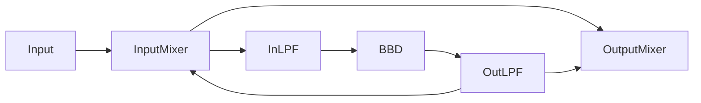

# Flanger
Based on a 2048 stage BBD.

# Design

    

# Inputs
    Analog controls
        Audio In
        LFO CV: input CV to use as external LFO. Will be ignored unless Rate and Depth are both zero
        Dry/Wet: output Mixer
        trimpot: for the BBD outputs balancing

    uC controls
        Rate: To control the speed of the embeded (in the uC) triangle LFO
        Depth: To control the amplitude of the LFO. 
        Offset: Base value on which the LFO will be added 

# Outputs
    Audio Out

